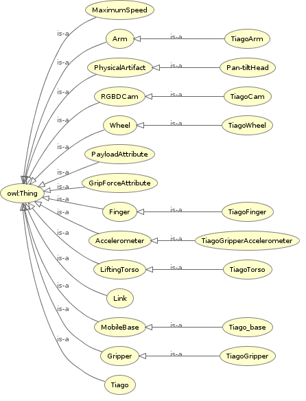

# Ontology

The ontology is based on the core ontologies used in KnowRob: SOMA,DUL,SRDL. Those are added as references in the folder.

The reason is that working on constructing an ontology definition for modelling objects and tasks is time consuming and require full knowledge of the objects, robots,tasks and interactions.

Based on definitions made in _SOMA_, we can describe tasks and objects. For example _hasBodyPart_ is an object property introduced in _SOMA_ and Tiago can use it to define its own parts. That is the approach followed in the development of the ontology. Also, in case we want to work on Knowrob later when it's stable, it will make it easier.

## Ontology for Tiago

Class Diagram:

To see data properties, instances of classes, object properties and more, you can load the file _Tiago.owl_ in Protege. 

[TODO] =====> Fix link names using URDF description file for the instance of Tiago created.

## What is needed from SOMA

Apart from types used in modelling _Tiago_ below elements from SOMA will be used for Grasping task:

- Physical Task::Task   A task in which a PhysicalAgent affects some physical object.

    - Actuating 
        - Delivering
        - Lowering
        - Positioning
    - Assuming Pose
        - Assuming Arm Pose
        - Setting Gripper
    -Manipulation
        - End Effect Positioning
            - Reaching
            - Retracting
        - Grasping
    - Navigating
        - Distancing
        - MovingTo 
    - Perceiving
        - Checking Object Presence
        - Placing (different from positioning where precise location is known)

- Action Execution Plan::Plan idea: steps in workflows assert that they are defined by action execution plans. Links role and parameter fillers to e.g. slots in a data structure.